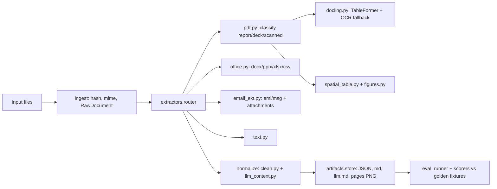

# AMR Preprocess: Greenfield Repo Implementation Plan

## Goal

Stand up a new repository containing the current, fully hardened state of [amr-preprocess](amr-preprocess) — a CLI pipeline converting review-pack files (PDF, DOCX, PPTX, XLSX/CSV, EML/MSG, text) into a single `ProcessedDocument` contract, with a Docling table/OCR fallback, prompt-ready LLM context output, and a scored eval harness.

## Architecture to reproduce

## Requirements

### Functional

- FR1 — Ingest PDF, DOCX (legacy .doc with warning), PPTX, XLSX, CSV, EML, MSG, and TXT/MD; unknown types fall back to text extraction with a warning.
- FR2 — Every input converges on one `ProcessedDocument` contract: structured JSON plus normalized Markdown, with page/bbox provenance on every block and table.
- FR3 — PDFs are classified (report / deck / scanned) before extraction and routed accordingly.
- FR4 — Table extraction is a confidence ladder: native office tables, PyMuPDF `find_tables`, Docling TableFormer, spatial whitespace reconstruction; the highest-confidence candidate wins (Docling wins ties on decks).
- FR5 — OCR (via Docling) applies only to scanned PDFs and deck pages with no usable text layer.
- FR6 — Email attachments are re-ingested as child documents (`parent_doc_id`), deduplicated by content hash across the run.
- FR7 — Page images are classified decorative vs data-bearing; data-bearing figures are saved and linked to caption blocks.
- FR8 — Prompt-ready LLM context output: page anchors, tables interleaved at their page, confidence flags, figure notes, optional token-budgeted chunking.
- FR9 — Eval harness replays golden fixtures and gates on thresholds (schema, doc class, provenance, table cells, block recall); every run writes versioned artifacts under a `run_id`.
- FR10 — Graceful degradation everywhere: no optional dependency is required for the core path; failures surface as explicit warnings (password-protected PDF, missing OCR extra, Docling conversion failure), never silent empty output.

### Non-functional

- NFR1 — Local-first: no network calls at runtime; Docling models are cached locally (prefetch supported for air-gapped machines).
- NFR2 — Deterministic evals: `AMR_DOCLING=0` disables the model-based path so fixtures score identically across machines.
- NFR3 — Performance: at most one Docling conversion per document (lazy, cached converter); OCR only when needed; page PNG rendering optional.
- NFR4 — Python 3.10+; permissive-license dependencies only (Docling is MIT).
- NFR5 — Every routing branch testable without heavy optional deps (fake-adapter pattern); real-Docling test gated by `skipif`.
- NFR6 — Warnings are first-class quality signals, propagated to the run manifest and into LLM context headers.

## Design decisions (the "why" behind the code)

- **Pydantic contract as the seam.** `ProcessedDocument` isolates consumers (LLM prompts, retrieval, evals) from extractor churn. New extractors change nothing downstream.
- **doc_id = sha256[:16] of content.** Identity is content, not path — the same attachment arriving twice dedupes automatically and parent/child links survive.
- **One shared confidence heuristic** (`score_rows`) across all table methods so candidates are directly comparable; 0.7 is the "good enough" line below which fallbacks engage.
- **Docling over a vision LLM.** Local, MIT-licensed, deterministic-enough, and TableFormer specifically targets borderless/merged financial tables. The adapter interface (`available` / `tables_for_page` / `text_blocks` / `convert_warning`) is deliberately narrow so MinerU or a hosted service could slot in behind it.
- **`convert_warning()` never triggers a conversion** — status inspection must be side-effect-free, or a report that never needed Docling pays a full model run.
- **Bbox origin normalization at the adapter boundary.** Docling's bottom-left origin boxes are flipped to PyMuPDF's top-left convention inside the adapter, so the rest of the pipeline has exactly one coordinate system.
- **`split_header` numeric-cell rule.** A header row is one with no numeric values — labels with digits (`FY25`, `Q2`) are still headers; only numbers/currency/percent (`1200`, `$1,200`, `9%`, `(300)`) mark data rows. Single shared implementation.
- **LLM context is a separate rendering, not a replacement.** Archival markdown stays stable for diffing/evals; `.llm.md` optimizes for prompting (interleaving, anchors, confidence flags) and can evolve freely.

## Stage 0: Repo scaffold

- Create the new repo directory (default: sibling folder, e.g. `amr-pipeline/`; avoid colons in the path — the current workspace path broke venv creation), `git init`, first commit per stage.
- `pyproject.toml`: setuptools, `requires-python >= 3.10`, deps `pymupdf, python-docx, python-pptx, openpyxl, extract-msg, pydantic>=2, typer, pyyaml, rich`; extras `dev=[pytest]`, `docling=[docling>=2.0]` (no `vision` extra — the Anthropic adapter was removed); script entry `amr-preprocess = amr_preprocess.cli:app`; pytest `testpaths=["tests"]`, `pythonpath=["src"]`.
- `.gitignore`: `artifacts/`, `evals/fixtures/.eval-runs/`, `__pycache__/`, `samples/`.
- README covering: install (venv outside colon paths), commands, routing table, Docling notes (first-run model download, `AMR_DOCLING=0` kill switch, OCR policy), `--llm-context` docs.

## Stage 1: Contract ([models.py](amr-preprocess/src/amr_preprocess/models.py))

Pydantic models, copied as-is: `DocClass` enum (report/deck/scanned/docx/pptx/sheet/email/text/unknown), `BBox`, `TextBlock`, `ExtractedTable` (headers/rows as list-of-rows, `extraction_method`, `confidence`, `bbox`), `FigureAsset`, `FigureLink`, `RawDocument`, `Attachment` (excluded from serialization), `ExtractedDocument`, `ProcessedDocument` (adds `markdown`, `pipeline_version`), `RunManifest`.

## Stage 2: Ingest ([ingest/loader.py](amr-preprocess/src/amr_preprocess/ingest/loader.py))

- `content_hash` = sha256[:16] (doc_id = content identity, dedupes attachments).
- `sniff_mime` extension map with `%PDF-`/`PK` magic-byte fallback.
- `ingest_bytes`/`ingest_path` writing raw bytes under the run dir.

## Stage 3: Extractors

Build in this order (dependencies flow downward):

1. **[spatial_table.py](amr-preprocess/src/amr_preprocess/extractors/spatial_table.py)** — `score_rows` confidence heuristic (fill ratio, merged-cell penalty, ragged penalty, long-cell penalty) and whitespace-clustering table reconstruction from PyMuPDF words.
2. **[figures.py](amr-preprocess/src/amr_preprocess/extractors/figures.py)** — decorative-vs-data-bearing image gate, caption-based figure-to-block linking.
3. **[docling.py](amr-preprocess/src/amr_preprocess/extractors/docling.py)** — the optional adapter, with all hardening applied:
   - `DoclingExtractor(pdf_path, ocr, cell_matching)`: lazy one-shot conversion, module-level converter cache keyed on `(ocr, cell_matching)`, `available()` honoring `AMR_DOCLING=0`.
   - `convert_warning()` must NOT trigger a conversion (only reports an already-run one).
   - `PdfPipelineOptions(do_ocr=…, do_table_structure=True)` + `TableFormerMode.ACCURATE`, defensive fallback to bare `DocumentConverter()`.
   - `_page_heights` + bbox origin flip: bottom-left provenance boxes converted to PyMuPDF top-left using page height.
   - `grid_from_table` handling cell offsets, spans, and DataFrame export fallback.
   - `split_header` with the numeric-cell rule: `_NUMERIC_CELL = ^[\s$€£(+-]*[\d,.]+[\s%)]*$` — labels like `FY25`/`Q2` are header cells; only true numbers/currency/percent mark data rows. This is the single shared implementation (pdf.py imports it).
4. **[pdf.py](amr-preprocess/src/amr_preprocess/extractors/pdf.py)** — classification and routing with all fixes:
   - `classify_pdf`: producer/creator hints + text-density (empty ratio > 0.6 = scanned; PPT hints or sparse = deck; InDesign/EDGAR or dense = report).
   - Password guard: `doc.needs_pass` returns early with `doc_class=UNKNOWN` and a "password-protected PDF; extraction skipped" warning.
   - OCR policy: scanned always; deck only when some page has < 50 chars of text (image-only tables); reports never.
   - Table selection: PyMuPDF if confidence >= 0.7; else Docling; else spatial-vs-PyMuPDF by confidence. Decks pick the highest-confidence candidate set with Docling winning ties. Warnings distinguish "returned no tables" (only when conversion succeeded) from install hints.
   - Doc-level: Docling conversion error surfaced exactly once; scanned docs merge `docling.text_blocks()` only for pages lacking PyMuPDF text, then sort blocks by page.
5. **[office.py](amr-preprocess/src/amr_preprocess/extractors/office.py)**, **[email_ext.py](amr-preprocess/src/amr_preprocess/extractors/email_ext.py)** (EML via stdlib parser, MSG via extract-msg; attachments re-queued as child docs), **[text.py](amr-preprocess/src/amr_preprocess/extractors/text.py)**, **[router.py](amr-preprocess/src/amr_preprocess/extractors/router.py)** (mime/extension dispatch, unknown types fall back to text with a warning).

## Stage 4: Normalize

1. **[clean.py](amr-preprocess/src/amr_preprocess/normalize/clean.py)** — whitespace/nbsp cleanup, `to_markdown` (title, headings, tables appended under `### Table <id>`), shared `table_to_markdown` pipe-table renderer.
2. **[llm_context.py](amr-preprocess/src/amr_preprocess/normalize/llm_context.py)** — prompt-ready output:
   - `to_llm_context`: metadata header (`<!-- doc:… class:… pages:… -->`), deduped warnings as `> Extraction notes:`, `<!-- page N -->` anchors, per-page interleaving of blocks then tables (labeled with method + confidence, `low confidence, verify against the source` below 0.7) then data-bearing figure notes with caption/image path. Decorative figures excluded.
   - `chunk_llm_context(doc, max_tokens)`: page-aligned greedy packing at ~4 chars/token, each chunk self-describing with `Part i of k (pages a-b of n)`.

## Stage 5: Validate + artifacts

- **[validate/schema.py](amr-preprocess/src/amr_preprocess/validate/schema.py)** — id/filename/page-count checks, ragged-column warning.
- **[artifacts/store.py](amr-preprocess/src/amr_preprocess/artifacts/store.py)** — run dirs (`raw/`, `docs/`, `pages/`), `save_documents` (extracted.json, processed.json, md), `save_llm_context` (single `.llm.md` or `.llm.partNN.md`), manifest writer.

## Stage 6: Pipeline + CLI

- **[pipeline.py](amr-preprocess/src/amr_preprocess/pipeline.py)** — BFS queue over inputs and email attachments, content-hash dedupe with parent-child linking (including re-save of parents whose children were deduped), `llm_context`/`llm_max_tokens` params.
- **[cli.py](amr-preprocess/src/amr_preprocess/cli.py)** — `process` (with `--llm-context`, `--llm-max-tokens`, `--no-render-pages`), `eval`, `sample`; paths resolved relative to package root.

## Stage 7: Samples + eval harness

- **[samples.py](amr-preprocess/src/amr_preprocess/samples.py)** — synthetic report PDF (InDesign metadata, dense), deck PDF (PowerPoint metadata, sparse), docx/pptx/xlsx/csv/eml/txt generators; `write_eval_fixtures` with `expected.json` per case (report-pdf, deck-pdf, docx-notes, xlsx-pipeline, eml-pack).
- **[scorers.py](amr-preprocess/src/amr_preprocess/scorers.py)** — schema_valid, doc_class, provenance_coverage, table_cell_accuracy (flat cell-set recall), block_recall (must_contain needles).
- **[eval_runner.py](amr-preprocess/src/amr_preprocess/eval_runner.py)** + `evals/config.yaml` thresholds (schema 1.0, doc_class 0.8, provenance 0.8, table cells 0.6, block recall 0.8).

## Stage 8: Tests (port all 23)

- [tests/test_pipeline.py](amr-preprocess/tests/test_pipeline.py) — classification, end-to-end processing, email children, office tables.
- [tests/test_docling.py](amr-preprocess/tests/test_docling.py) — grid building, digit-label headers, bbox origin flip, `AMR_DOCLING=0`, non-triggering `convert_warning`, deck tie-preference and low-confidence loss, scanned OCR merge, single failure warning, missing-extra flag, password-protected skip, `skipif`-gated real-Docling integration test.
- [tests/test_llm_context.py](amr-preprocess/tests/test_llm_context.py) — interleaving order, low-confidence/warning rendering, chunk budgets, pipeline writes `.llm.md`.
- [tests/test_eval.py](amr-preprocess/tests/test_eval.py), [tests/test_quality_gates.py](amr-preprocess/tests/test_quality_gates.py).

## Stage 9: Verification

- Venv outside the repo if the path contains special chars; `pip install -e ".[dev]"`.
- `pytest -q` — expect 22 passed, 1 skipped (docling integration, unless extra installed).
- `amr-preprocess sample && amr-preprocess eval` — all five gates PASS (table_cell_accuracy ~0.889).
- `amr-preprocess process samples --llm-context --no-render-pages` — verify `.llm.md` page anchors and low-confidence flags.

## Best practices

Build discipline:

- One commit per stage, each leaving the repo runnable and its tests green. Copy source files from the tested tree rather than rewriting.
- Never let an optional dependency break the core path: import inside functions, degrade with a warning, and surface each failure once per document (not per page).
- Fake-adapter pattern for heavy optional deps in tests; `skipif`-gate the real integration test so CI passes without torch installed.
- Keep confidence scoring shared and comparable across extraction methods; never invent a second scale.
- Provenance (page, bbox) on every block and table — downstream citation and figure linking depend on it.
- Env kill switches (`AMR_DOCLING=0`) for any model-based component so evals stay deterministic.
- Cache expensive converters at module level, keyed by their options; convert each document at most once.
- Stamp `pipeline_version` into every output so artifacts are traceable to code.

Extension rules:

- New format: add an extractor, register it in `extractors/router.py`, add one golden fixture under `evals/fixtures/<case>/` with `expected.json`.
- New quality check: add a scorer function and a threshold in `evals/config.yaml`.
- New table method: emit `ExtractedTable` with `extraction_method` and `score_rows` confidence; plug into the existing ladder rather than bypassing it.

Environment:

- Create the venv outside paths containing special characters (the current workspace path contains a colon, which breaks venv creation).
- Python 3.10+ is required by both the package and Docling; do not develop against the 3.9 workspace venv.

## Notes

- Deferred items (documented, not built): scanned-PDF eval fixture, multi-page table stitching, numeric cell normalization, Docling benchmark on `financial-reports/`, ColPali retrieval branch.
